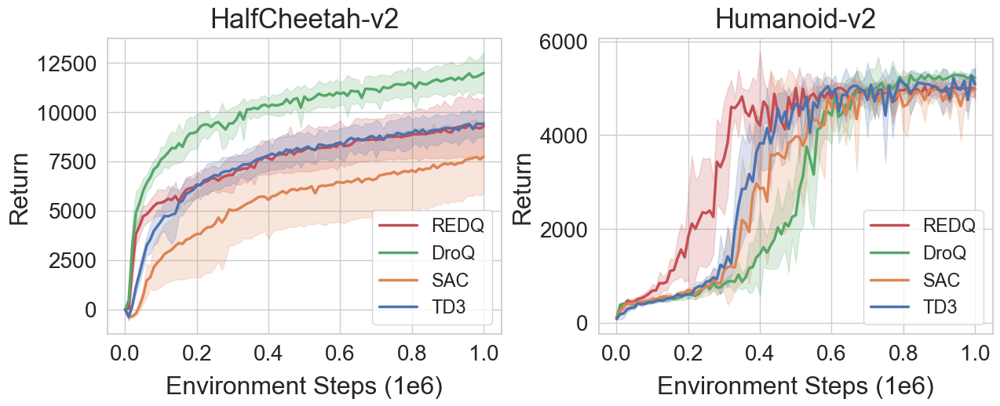
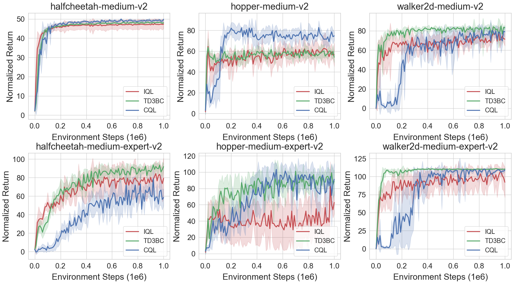

## JaxRL: LightWeight Deep Reinforcement Learning Libraray Written in JAX
JaxRL is a simple and modular online and offline reinforcement learning algorithm library written in JAX, which is inspired by some other code bases (i.e., [Spinning Up repository](https://github.com/openai/spinningup),  [Implicit Q-Learning](https://github.com/ikostrikov/implicit_q_learning), and [A Walk in the Park](https://github.com/ikostrikov/walk_in_the_park)).

## Supported algorithms
Currently, following algorithms have been implemented.

|**Algorithm**                 |**Online**|**Offline**|**Deterministic**|**Stochastic**|
| :--         | :--      | :--:           | :--:          | :--:                    |
| Soft Actor-Critic (SAC)[[1]](#reference)         | :heavy_check_mark: | - | - | :heavy_check_mark: |
| Twin Delayed Deep Deterministic Policy Gradients (TD3)[[2]](#reference)         | :heavy_check_mark: | - | :heavy_check_mark: | - |
| Randomized Ensembled Double Q-Learning (REDQ)[[3]](#reference)        | :heavy_check_mark: | - | - | :heavy_check_mark: |
| Dropout Q-Functions (DroQ)[[4]](#reference)      | :heavy_check_mark: | - | - | :heavy_check_mark: |
| Conservative Q-Learning (CQL)[[5]](#reference)        | - | :heavy_check_mark: | - | :heavy_check_mark: |
| A Minimalist Approach to Offline Reinforcement Learning (TD3-BC)[[6]](#reference)     | - | :heavy_check_mark: | :heavy_check_mark: | - |
| Implicit Q-Learning (IQL)[[7]](#reference)        | - | :heavy_check_mark: | - | :heavy_check_mark: |

## Prerequisites
```bash
# python        3.6 
# pytorch       1.5.0 
# tensorflow    1.14.0
# jax           0.2.14
# jaxlib        0.1.69+cuda101
# flax          0.3.5
# gym           0.20.0
# mujoco-py     2.0.2.13
# d4rl          1.1
```

## Launch experiments
### Online training
```bash
# SAC agent
python train.py --policy sac --env_name HalfCheetah-v2 --seed 0
# TD3 agent
python train.py --policy td3 --env_name HalfCheetah-v2 --seed 0
# REDQ agent
python train.py --policy redq --env_name HalfCheetah-v2 --seed 0 --utd 20 --num_qs 10
# DroQ agent
python train.py --policy droq --env_name HalfCheetah-v2 --seed 0 --utd 20 --critic_dropout_rate 0.01
```

### Offline training
```bash
# IQL agent
python train.py --policy iql --env_name halfcheetah-medium-2 --seed 0 --iql_expectile 0.7 --iql_temp 3.0
# TD3BC agent
python train.py --policy td3bc --env_name halfcheetah-medium-2 --seed 0
# CQL agent
python train.py --policy cql --env_name halfcheetah-medium-2 --seed 0 --min_q_weight 5.0
```

### Run with the scripts `run.sh`:
```bash
bash run.sh
```

## Performance
### Online

<br>

### Offline

<br>

## Speed
The time in seconds per 1000 training steps with the same hyperparameters and machines.

|                         |     PyTorch     |      JAX      |
|-------------------------|:---------------:|:-------------:|
| SAC[[1]](#reference)    |  5.671 ± 0.021  | 1.748 ± 0.033 |
| TD3[[2]](#reference)    |  3.783 ± 0.023  | 1.661 ± 0.064 |
| REDQ[[3]](#reference)   | 226.432 ± 0.683 | 9.251 ± 0.028 |
| DroQ[[4]](#reference)   | 95.780 ± 0.824  | 5.664 ± 0.027 |
| TD3-BC[[6]](#reference) |  3.457 ± 0.012  | 1.317 ± 0.122 |
| IQL[[7]](#reference)    |  5.294 ± 0.022  | 1.351 ± 0.044 |

[//]: # (| Conservative Q-Learning &#40;CQL&#41;[[5]]&#40;#reference&#41;                                    |  5.57 ± 0.07  | 1.717 ± 0.003 |)


## Reference
[[1]](https://arxiv.org/abs/1812.05905) Haarnoja, T.; Zhou, A.; Abbeel, P.; and Levine, S. 2018. Soft Actor-Critic: Off-Policy Maximum Entropy Deep Reinforcement Learning with a Stochastic Actor. In International Conference on Machine Learning, 1861–1870. PMLR.

[[2]](https://arxiv.org/abs/1802.09477) Fujimoto, S.; Hoof, H.; and Meger, D. 2018. Addressing Function Approximation Error in Actor-Critic Methods. In International Conference on Machine Learning, 1587–1596. PMLR.

[[3]](https://arxiv.org/abs/2101.05982) Chen, X.; Wang, C.; Zhou, Z.; and Ross, K. W. 2020. Randomized Ensembled Double Q-Learning: Learning Fast Without a Model. In International Conference on Learning Representations.

[[4]](https://arxiv.org/abs/2110.02034) Hiraoka, T.; Imagawa, T.; Hashimoto, T.; Onishi, T.; and Tsuruoka, Y. 2021. Dropout Q-Functions for Doubly Efficient Reinforcement Learning. In International Conference on Learning Representations.

[[5]](https://arxiv.org/abs/2006.04779) Kumar, A.; Zhou, A.; Tucker, G.; and Levine, S. 2020. Conservative Q-Learning for Offline Reinforcement Learning. Advances in Neural Information Processing Systems, 33: 1179–1191.

[[6]](https://arxiv.org/abs/2106.06860) Fujimoto, S.; and Gu, S. S. 2021. A Minimalist Approach to Offline Reinforcement Learning. Advances in Neural Information Processing Systems, 34: 20132–20145.

[[7]](https://arxiv.org/abs/2110.06169) Kostrikov, I.; Nair, A.; and Levine, S. 2021. Offline Reinforcement Learning with Implicit Q-Learning. In International Conference on Learning Representations.